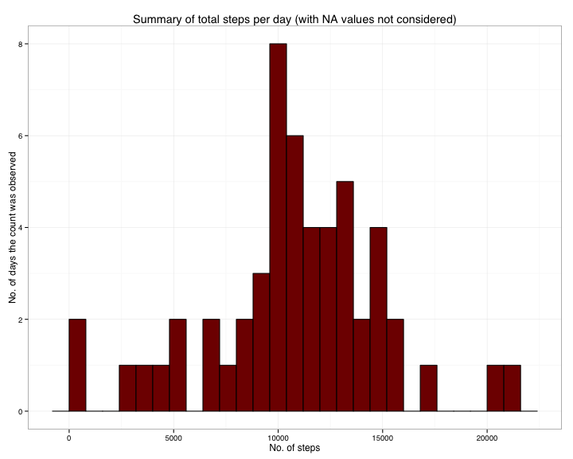
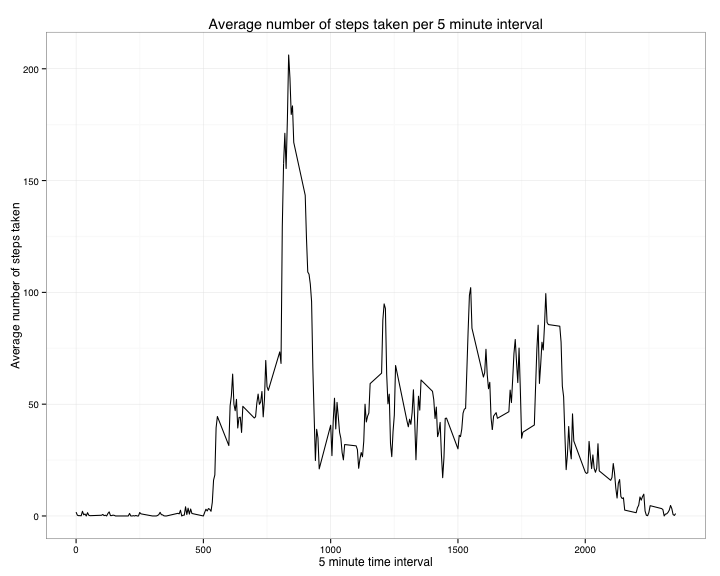
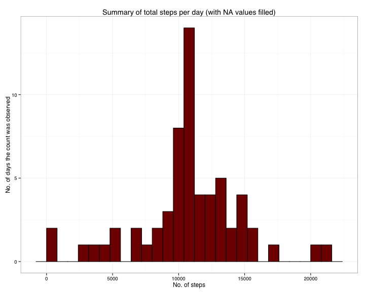
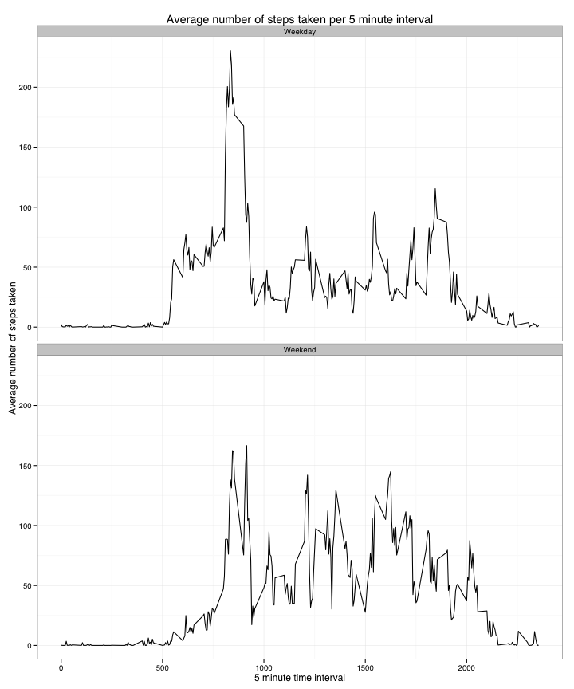

# Reproducible Research: Peer Assessment 1

It is now possible to collect a large amount of data about personal movement using activity monitoring devices such as a Fitbit, Nike Fuelband, or Jawbone Up. These type of devices are part of the "quantified self" movement -- a group of enthusiasts who take measurements about themselves regularly to improve their health, to find patterns in their behavior, or because they are tech geeks. But these data remain under-utilized both because the raw data are hard to obtain and there is a lack of statistical methods and software for processing and interpreting the data.

This assignment makes use of data from a personal activity monitoring device. This device collects data at 5 minute intervals through out the day. The data consists of two months of data from an anonymous individual collected during the months of October and November, 2012 and include the number of steps taken in 5 minute intervals each day.

## Loading and preprocessing the data

The dataset has been taken from the Coursera Reproducible Research Project 1 link. https://d396qusza40orc.cloudfront.net/repdata%2Fdata%2Factivity.zip

We can directly download the file and unzip the file in R. If the file is already present in the current working directory the download will not be carried out. For loading and analyzing the data, we will use the following libraries in R which needs to be sourced.

* datasets
* reshape2
* ggplot2
* sqldf


```r
## Clearing previous environment
rm(list=ls())
## Download the data from the source. If the file has been downloaded before, the download is skipped
zipFileUrl <- "https://d396qusza40orc.cloudfront.net/repdata%2Fdata%2Factivity.zip"
if (!file.exists("repdata-data-activity.zip")) {
        download.file(zipFileUrl, destfile="repdata-data-activity.zip", method="curl")
}
## Unzip the source file. If the file is already unzipped, this step is skipped
if (!file.exists("activity.csv")) {
        unzip("repdata-data-activity.zip")
}

## Source the required libraries
# The following commands are present for the sake of completion. 
# If the packages are not present in your R environment, please uncomment the below lines.

#install.packages("datasets", dependencies=TRUE)
#install.packages("reshape2", dependencies=TRUE)
#install.packages("ggplot2", dependencies=TRUE)
#install.packages("sqldf", dependencies=TRUE)
library(datasets)
library(reshape2)
library(ggplot2)
library(sqldf)
```

Once the data is available to us, we will load the data in R. 


```r
activityData <- read.csv("activity.csv")

# First few rows of the data
head(activityData)
```

```
##   steps       date interval
## 1    NA 2012-10-01        0
## 2    NA 2012-10-01        5
## 3    NA 2012-10-01       10
## 4    NA 2012-10-01       15
## 5    NA 2012-10-01       20
## 6    NA 2012-10-01       25
```

As we load the data in R, we notice that quite a few rows have missing NA values.

## What is mean total number of steps taken per day?

### Total Number of Steps taken by a person each day

First we try to find out how the total number of steps taken by a person each day varies. **The NA values are ignored for this section.** We will use a histogram to visualize this.


```r
# Creating an aggregate with sum of each date. This automatically removed the NA rows
sumActivityData <- aggregate(steps ~ date, activityData, sum)
head(sumActivityData)
```

```
##         date steps
## 1 2012-10-02   126
## 2 2012-10-03 11352
## 3 2012-10-04 12116
## 4 2012-10-05 13294
## 5 2012-10-06 15420
## 6 2012-10-07 11015
```

```r
# Generating a histogram to show the trend about "Total Number of Steps taken by a person per day"
ggplot(sumActivityData, aes(x=steps)) + 
  geom_histogram(binwidth=800, colour="black", fill="#800000") + 
	theme_bw(base_family = "Helvetica", base_size = 12) +
	labs(x = "No. of steps", y = "No. of days the count was observed") +
	ggtitle("Summary of total steps per day (with NA values not considered)")
```



### Mean and Median of the Total Number of Steps taken by a person each day

The following commands give us the Mean and median values for the total number of steps taken per day


```r
# Calculating the mean and median values of total number of steps per day
meanSteps <- mean(sumActivityData$steps)
print(meanSteps)
```

```
## [1] 10766
```

```r
medianSteps <- median(sumActivityData$steps)
print(medianSteps)
```

```
## [1] 10765
```

- The Mean value of total number of steps taken per day = **1.0766 &times; 10<sup>4</sup>**
- The Median value of total number of steps taken per day = **10765**

## What is the average daily activity pattern?

### Calculate average number of steps per 5 minute interval across all days

We are now trying to find out a pattern in daily activity. We will use the average values to see this trend. There are a total of 288 "5-minute" intervals and for each interval we calculate a mean across all days. **The NA values are ignored for this section.**


```r
# Subsetting the data by removing the date from the equation. 
# We are only interested in the 5 minute interval and the no of steps 
# taken during that interval
subData <- activityData[, c("interval", "steps")]
# Calculating the mean number of steps taken for each 5 minute interval
moltensubData <- melt(subData, id = c("interval"), na.rm=TRUE)
avgIntervalSubData <- dcast(moltensubData, interval ~ variable, mean)

# Generating a line plot for average number of steps taken for each 5 minute interval
ggplot(avgIntervalSubData, aes(x = interval, y = steps)) +  
  theme_bw(base_family = "Helvetica", base_size = 12) +
	labs(x = "5 minute time interval", y = "Average number of steps taken") +
	ggtitle("Average number of steps taken per 5 minute interval") + 
	geom_line()
```



### 5 minute interval with maximum number of steps on average across all days

We can find the specific 5 minute interval which has the maximum average number of steps using the following code:


```r
max_interval <- subset(avgIntervalSubData, avgIntervalSubData$steps==max(avgIntervalSubData$steps))[["interval"]]
print(max_interval)
```

```
## [1] 835
```

The interval which on average contains the maximum number of steps is = **835**


## Imputing missing values

As noted before, there are rows where the data is missing. This is mentioned as NA in the dataset. Calculating mean, median etc. using this data can result in biased outcome. 

### Total number of rows with missing values (NA)

The following code chunk gives us the total number of rows with missing values.


```r
# Form a subset of the original dataset with rows that contain missing values
missingRows <- subset(activityData, is.na(activityData))
# The number of rows with missing values are
nrow(missingRows)
```

```
## [1] 2304
```

Total number of rows with missing values = **2304**

### Replace missing values with proper values following a strategy

Now we will try to replace the missing values (NA) with proper values. The strategy we will use here is replacing the NA for a particular 5 minute interval with the mean for that interval across all days.

### Create a new dataset with the strategy decided above and replacing the missing values

We will now create a new dataset which is identical to the original dataset **but with the missing values filled in**. The following code chunk achives this.


```r
newDataSet <- activityData
newDataSet$imputed <- newDataSet$steps

for(rowNo in row.names(missingRows)) {
  currInterval <- newDataSet[rowNo, "interval"]
	corresponding_mean_step <- fn$sqldf("select steps from avgIntervalSubData where interval = '$currInterval'")
	newDataSet[rowNo, "imputed"] <- corresponding_mean_step
	rm(corresponding_mean_step)
	rm(currInterval)
}
```

```
## Loading required package: tcltk
```

```r
newDataSet$steps <- newDataSet$imputed
newDataSet$imputed <- NULL

#First few rows of data (now with no NA values)
head(newDataSet)
```

```
##     steps       date interval
## 1 1.71698 2012-10-01        0
## 2 0.33962 2012-10-01        5
## 3 0.13208 2012-10-01       10
## 4 0.15094 2012-10-01       15
## 5 0.07547 2012-10-01       20
## 6 2.09434 2012-10-01       25
```

### Show total number of steps taken per day after replacing missing values and calculate mean and median

Below is a histogram that shows the total number of steps taken per day. **This time using the new dataset with filled data for NA.**


```r
# Creating an aggregate with sum of each date. This automatically removed the NA rows
newSumActivityData <- aggregate(steps ~ date, newDataSet, sum)
head(newSumActivityData)
```

```
##         date steps
## 1 2012-10-01 10766
## 2 2012-10-02   126
## 3 2012-10-03 11352
## 4 2012-10-04 12116
## 5 2012-10-05 13294
## 6 2012-10-06 15420
```

```r
# Generating a histogram to show the trend about "Total Number of Steps taken by a person per day"
ggplot(newSumActivityData, aes(x=steps)) + 
  geom_histogram(binwidth=800, colour="black", fill="#800000") + 
	theme_bw(base_family = "Helvetica", base_size = 12) +
	labs(x = "No. of steps", y = "No. of days the count was observed") +
	ggtitle("Summary of total steps per day (with NA values filled)")
```



The following commands give us the Mean and median values for the total number of steps taken per day for the new dataset.


```r
# Calculating the mean and median values of total number of steps per day
newMeanSteps <- mean(newSumActivityData$steps)
print(newMeanSteps)
```

```
## [1] 10766
```

```r
newMedianSteps <- median(newSumActivityData$steps)
print(newMedianSteps)
```

```
## [1] 10766
```

- The Mean value of total number of steps taken per day for new dataset = **1.0766 &times; 10<sup>4</sup>**
- The Median value of total number of steps taken per day for new dataset = **1.0766 &times; 10<sup>4</sup>**

### Impact of imputting

The new mean and median estimates are similar to the previous values. However the mean value is now same as median value. Since the number of NA rows were not significant these 2 estimates didnt shift much.

## Are there differences in activity patterns between weekdays and weekends?

We are now trying to find the difference in activity patterns between weekdays and weekends. We will consider the new dataset with filled in NA values for this calculation.

### Create a factor variable specifying date as "Weekday" or "Weekend"

Our end goal is to create a new factor variable for each row that specifies whether the date is a "Weekday" or "Weekend". We are using a 2 step approach for this. First we are using the "weekdays()" function to create a new character variable which simply mentions whether the date is "Monday", "Tuesday" .... and so on. Then using this information we find out whether the day is a "Weekday" or "Weekend" and this information is saved in a new variable. Once the process in completed, the older weekdays() variable is deleted as it is not required by us.


```r
# Convert the "date" column to a "Date" datatype
newDataSet$date <- as.Date(newDataSet$date, format="%Y-%m-%d")
# Create a new column dayOfWeek that stores the day of the week for the respective dates
newDataSet$dayOfWeek <- weekdays(newDataSet$date)
# Create a new blank column typeOfDay of type character which will save the type of day 
# "Weekday" or "Weekend" later
newDataSet$typeOfDay <- vector(mode = "character", length=nrow(newDataSet))

# For each row we check is the dayofWeek if "Saturday" or "Sunday". If they are then we 
# add "Weekend" to the typeOfDay column else we add "Weekday"
for(rowNo in row.names(newDataSet)) {
  dayName <- newDataSet[rowNo, "dayOfWeek"]
	if(dayName %in% c("Saturday", "Sunday")) {
		newDataSet[rowNo, "typeOfDay"] <- c("Weekend")
	} else {
		newDataSet[rowNo, "typeOfDay"] <- c("Weekday")
	}
}
# Convert the typeOfDay column to factor type with 2 levels "Weekday" and "Weekend"
newDataSet$typeOfDay <- as.factor(newDataSet$typeOfDay)
# Remove the dayOfWeek column as it is not required anymore
newDataSet$dayOfWeek <- NULL

# First few rows of the updated dataset
head(newDataSet)
```

```
##     steps       date interval typeOfDay
## 1 1.71698 2012-10-01        0   Weekday
## 2 0.33962 2012-10-01        5   Weekday
## 3 0.13208 2012-10-01       10   Weekday
## 4 0.15094 2012-10-01       15   Weekday
## 5 0.07547 2012-10-01       20   Weekday
## 6 2.09434 2012-10-01       25   Weekday
```

### Show the pattern for average total number of steps for 5 minute interval between "Weekdays" and "Weekend"

We now plot a line graph to find out a pattern in daily activity between weekdays and weekend. We will use the average values to see this trend. There are a total of 576 (288 \* 2) "5-minute" intervals and for each interval we calculate a mean across all days. 


```r
# Subsetting the data by removing the date from the equation. We are only interested in the type of Day (Weekend or Weekday), 5 minute interval and the no of steps taken during that interval
newSubData <- newDataSet[, c("typeOfDay", "interval", "steps")]
# Calculating the mean number of steps taken for each 5 minute interval per type of Day
newMoltenData <- melt(newSubData, id = c("typeOfDay", "interval"))
avgIntervalSubData <- dcast(newMoltenData, typeOfDay + interval ~ variable, mean)

# Generating a line plot for average number of steps taken for each 5 minute interval for each of "Weekday" and "Weekend"
ggplot(avgIntervalSubData, aes(x = interval, y = steps)) +  
  theme_bw(base_family = "Helvetica", base_size = 12) +
	labs(x = "5 minute time interval", y = "Average number of steps taken") +
	ggtitle("Average number of steps taken per 5 minute interval") + 
	geom_line() + facet_wrap( ~ typeOfDay, ncol = 1)
```



We finally clear our environment to free up memory.

```r
## Clearing the environment. Comment this line if you dont need it.
rm(list=ls())
```
